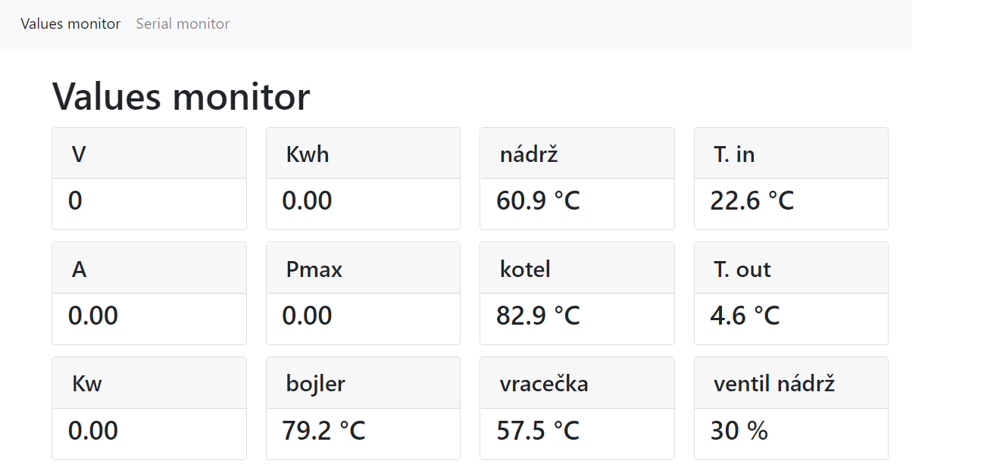
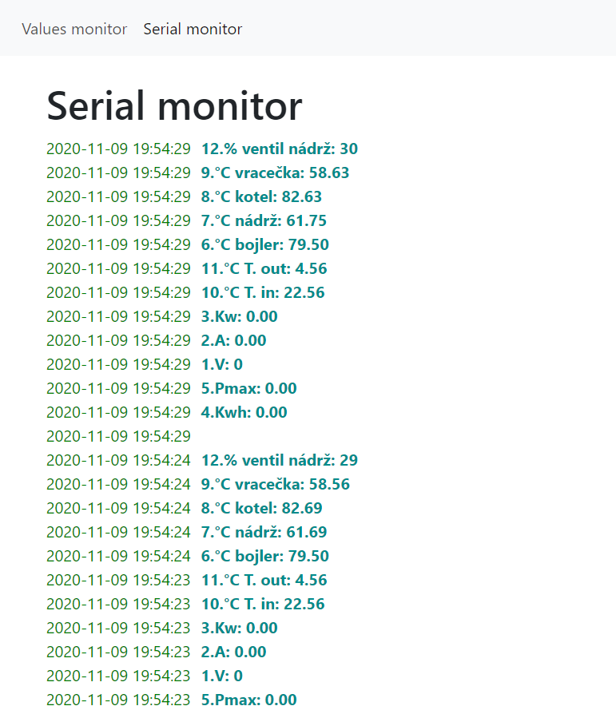

# arduino-publisher
Web interface exposing serial data of a connected Arduino.

In values monitor, values gathered from serial port can be displayed in a formatted fashion:

Serial monitor shows raw serial data with added timestamps.
